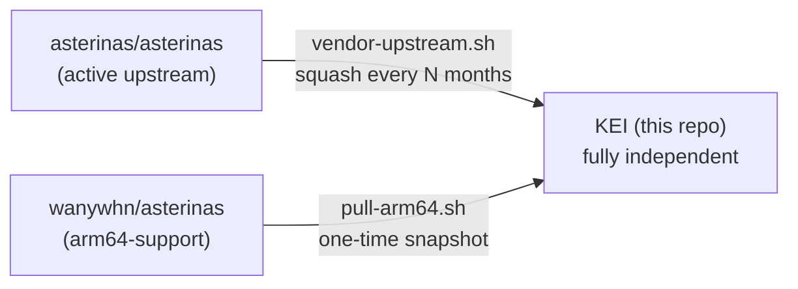
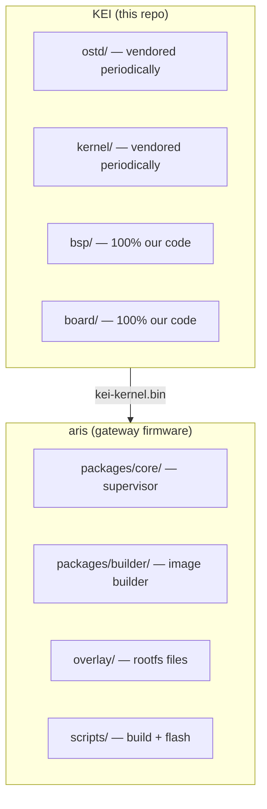

<p align="center"></p>

<h1 align="center">KEI</h1>

<p align="center"><strong>Asterinas ARM64 fork — independent kernel for industrial IoT gateways</strong></p>

<div align="center">

[](./LICENSE)
[](./LICENSE-MPL)
[](https://github.com/celestia-island/kei/actions/workflows/ci.yml)

</div>

<div align="center">

**English** ·
[简体中文](./docs/zhs/README.md) ·
[繁體中文](./docs/zht/README.md) ·
[日本語](./docs/ja/README.md) ·
[한국어](./docs/ko/README.md) ·
[Français](./docs/fr/README.md) ·
[Español](./docs/es/README.md) ·
[Русский](./docs/ru/README.md) ·
[العربية](./docs/ar/README.md)

</div>

## Introduction

KEI is an independent fork of [asterinas/asterinas](https://github.com/asterinas/asterinas)
with ARM64 support and Board Support Packages for industrial IoT gateways. It
provides the `kei-kernel.bin` consumed by [aris](https://github.com/celestia-island/aris).

## Fork Model

KEI is **not** a branch that tracks upstream. It is an independent fork that
periodically absorbs upstream changes on its own schedule — the same model Apple
uses for its LLVM fork.



KEI independently maintains `ostd/src/arch/aarch64/`, `kernel/src/arch/aarch64/`,
`bsp/`, `board/`, `configs/`, and `docs/`.

## Relationship to aris



## Quick Start

```bash
just setup        # Configure git remotes
just vendor       # Absorb latest upstream asterinas (squash)
just pull-arm64   # Pull ARM64 code from wanywhn fork (one-time)
just versions     # Show what upstream versions we're based on
just build        # Build kernel for nanopi-r3s (aarch64)
just test-all     # Boot-test all architectures in QEMU
```

## What Lives Where

| Directory | Origin | Maintenance |
|-----------|--------|-------------|
| `ostd/` | Upstream asterinas | Vendored periodically, bugs fixed in-place |
| `ostd/src/arch/aarch64/` | wanywhn fork (PR #3270) | **Independent** — we own this |
| `kernel/` | Upstream asterinas | Vendored periodically |
| `kernel/src/arch/aarch64/` | wanywhn fork (PR #3270) | **Independent** — we own this |
| `osdk/` | Upstream asterinas | Vendored periodically |
| `bsp/` | KEI | **100% ours** — Board Support Packages |
| `board/` `configs/` | KEI | **100% ours** — board definitions |
| `scripts/` `docs/` | KEI | **100% ours** — tooling and docs |

## Supported Architectures

| Arch | Status | QEMU Test |
|------|--------|-----------|
| x86_64 | Upstream Tier 1 | ✅ q35 |
| aarch64 | kei-maintained (from PR #3270) | ✅ virt/cortex-a55 |
| riscv64 | Upstream Tier 2 | ⚠️ virt/rv64 |
| loongarch64 | Upstream Tier 3 | ⚠️ virt/max |

## License

**SySL-1.0** (Synthetic Source License) for KEI's own code — see
[LICENSE](./LICENSE).

**MPL-2.0** for vendored Asterinas code (`ostd/`, `kernel/`, `osdk/`) — see
[LICENSE-MPL](./LICENSE-MPL).
