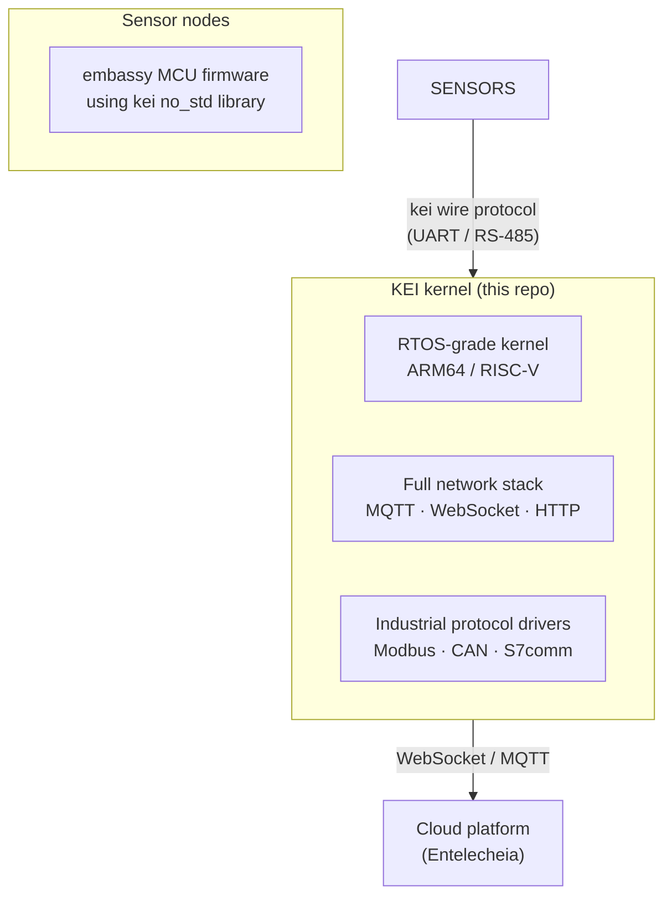

<p align="center"></p>

<h1 align="center">KEI</h1>

<p align="center"><strong>Rust OS kernel for industrial IoT gateways + no_std bridge library for embedded sensor nodes</strong></p>

<div align="center">

[](./LICENSE)
[](./LICENSE-MPL)
[](https://github.com/celestia-island/kei/actions/workflows/ci.yml)

</div>

<div align="center">

**English** ·
[简体中文](./docs/zhs/README.md) ·
[繁體中文](./docs/zht/README.md) ·
[日本語](./docs/ja/README.md) ·
[한국어](./docs/ko/README.md) ·
[Français](./docs/fr/README.md) ·
[Español](./docs/es/README.md) ·
[Русский](./docs/ru/README.md) ·
[العربية](./docs/ar/README.md)

</div>

## What problem does KEI solve?

Industrial IoT gateways sit between field devices (sensors, PLCs, actuators)
and the cloud. They need:

- **Real-time discipline** for time-critical protocol polling (Modbus, CAN)
- **Full network stack** for cloud connectivity (MQTT, WebSocket, HTTP)
- **Safety guarantees** that C-based RTOSes and full Linux cannot provide
- **Small, auditable footprint** — not millions of lines of code

No existing OS fills this gap well. Linux is too large and not deterministic.
Traditional RTOSes (FreeRTOS, Zephyr) lack a full network stack and memory
protection. KEI is built in Rust on a safe-kernel architecture, giving you
memory safety, real-time capability, and a complete protocol stack in one
system.



## What's in this repo?

Two components, one repository:

| Component | Location | What it does |
|-----------|----------|-------------|
| **KEI kernel** | workspace root | Rust OS kernel for ARM64/RISC-V edge devices. Runs the [evernight](https://github.com/celestia-island/evernight) protocol broker and connects to cloud platforms. |
| **kei library** | `packages/kei/` | `#![no_std]` library for embassy-based sensor nodes: wire protocol, manifest schema, HAL traits. Shared between MCU firmware and the gateway. |

The library has its own Cargo workspace (targets `thumbv7em-none-eabi` for
Cortex-M MCUs) and is excluded from the kernel's workspace.

### KEI kernel

```bash
just build              # Build kernel for default board (NanoPi R3S)
just build-board BOARD  # Build for a specific board
just test-all           # Boot-test all architectures in QEMU
```

Supported architectures: ARM64 (active), x86_64, RISC-V, LoongArch.

### kei library (`packages/kei/`)

```bash
cd packages/kei
cargo test --all-features              # Run unit + integration tests (20 tests)
cargo bench --bench wire_bench         # Run criterion benchmarks
cargo run --example host_demo          # Host-side wire protocol demo

# QEMU end-to-end demo (Cortex-M4 firmware + host gateway):
cd examples/qemu-mps2
cargo build --release --target thumbv7em-none-eabi
qemu-system-arm -M mps2-an386 -cpu cortex-m4 -m 16M \
    -display none -serial stdio \
    -kernel target/thumbv7em-none-eabi/release/kei-qemu-mps2
```

The QEMU demo includes an on-chip benchmark using the CMSDK hardware timer.
Release-build results (Cortex-M4 @ 25 MHz):

| Operation | Ticks | Time |
|-----------|-------|------|
| Frame encode (postcard + CRC16) | 14 | 560 ns |
| Frame decode (CRC verify + deserialize) | 11 | 440 ns |
| CRC16-Modbus (64 bytes) | 7 | 280 ns |
| Encode + decode round-trip | 43 | 1.7 µs |

At 115200 baud UART, a 23-byte frame takes ~2 ms to transmit — protocol
overhead is **under 0.1%** of physical I/O time.

## Ecosystem

KEI is part of the Celestia IoT platform:

- **[aris](https://github.com/celestia-island/aris)** — gateway Linux distribution (operator-facing)
- **[evernight](https://github.com/celestia-island/evernight)** — industrial protocol broker (Modbus, S7comm, CAN, MQTT)
- **[kei](https://github.com/celestia-island/kei)** — this repo: kernel + sensor bridge library

## License

SySL-1.0 (Synthetic Source License) for KEI's own code. Vendored code
remains under MPL-2.0. See [LICENSE](./LICENSE) and [LICENSE-MPL](./LICENSE-MPL).
