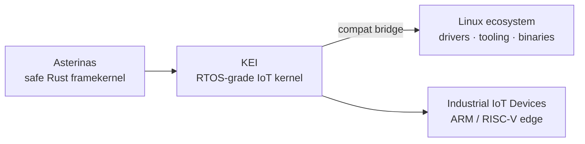
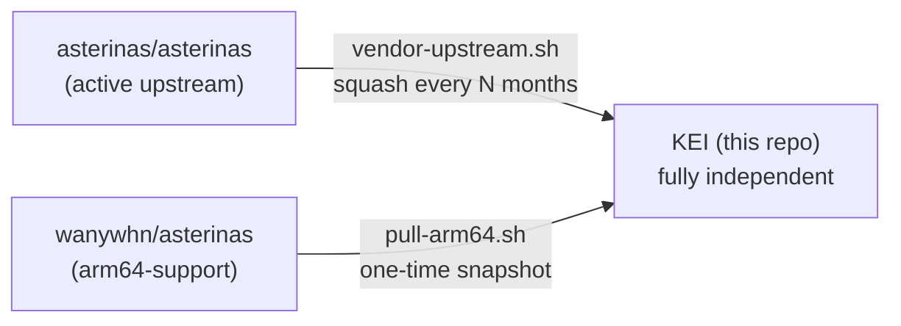

<p align="center"></p>

<h1 align="center">KEI-KERNEL</h1>

<p align="center"><strong>An IoT-oriented OS kernel — RTOS discipline on Asterinas, with Linux ecosystem access</strong></p>

<div align="center">

[](./LICENSE)
[](./LICENSE-MPL)
[](https://github.com/celestia-island/kei-kernel/actions/workflows/ci.yml)

</div>

<div align="center">

**English** ·
[简体中文](./docs/zhs/README.md) ·
[繁體中文](./docs/zht/README.md) ·
[日本語](./docs/ja/README.md) ·
[한국어](./docs/ko/README.md) ·
[Français](./docs/fr/README.md) ·
[Español](./docs/es/README.md) ·
[Русский](./docs/ru/README.md) ·
[العربية](./docs/ar/README.md)

</div>

## Introduction

KEI is an operating-system kernel purpose-built for industrial IoT. It takes
[Asterinas](https://github.com/asterinas/asterinas) and shapes it into an
RTOS-style facility — small, real-time, auditable — yet keeps a bridge into the
Linux ecosystem so existing drivers, tooling, and binaries remain within reach.

It is neither a Linux distribution nor stock Asterinas. The closest analogue is
an RTOS that happens to speak Linux: real-time determinism for the workload that
needs it, Linux-grade software compatibility for everything else.



## Where KEI sits

| | Linux | Asterinas (official) | **KEI** |
|---|---|---|---|
| Target | General-purpose servers / desktops | Research safe-kernel | Industrial IoT devices |
| Real-time discipline | ❌ best-effort | ⚠️ partial | ✅ RTOS-grade |
| Footprint | Large | Medium | Small, auditable |
| Linux ecosystem | — (is Linux) | Limited | ✅ bridged |

KEI-KERNEL is a sibling of [aris](https://github.com/celestia-island/aris)
and [kei](https://github.com/celestia-island/kei) in the Celestia ecosystem.
KEI-KERNEL is the device-side IoT kernel (this repo); [kei](https://github.com/celestia-island/kei)
is the shared `#![no_std]` bridge library (manifest schema, wire protocol,
protocol codecs) consumed by both embassy sensor nodes and the evernight
gateway. KEI-KERNEL depends on kei for manifest/codec types.

## Fork Model

KEI is **not** a branch that tracks upstream. It is an independent fork that
periodically absorbs upstream changes on its own schedule — the same model Apple
uses for its LLVM fork.



KEI independently maintains `ostd/src/arch/aarch64/`, `kernel/src/arch/aarch64/`,
`bsp/`, `board/`, `configs/`, and `docs/`. See the
[Upstream Sync guide](./docs/en/guides/upstream-sync.md) for how vendoring works.

## Quick Start

```bash
just setup        # Configure git remotes and Rust targets
just vendor       # Absorb latest upstream asterinas (squash)
just pull-arm64   # Pull ARM64 code from wanywhn fork (one-time)
just versions     # Show what upstream versions we're based on
just build        # Build kernel for nanopi-r3s (aarch64)
just test-all     # Boot-test all architectures in QEMU
```

## What Lives Where

| Directory | Origin | Maintenance |
|-----------|--------|-------------|
| `ostd/` | Upstream asterinas | Vendored periodically, bugs fixed in-place |
| `ostd/src/arch/aarch64/` | wanywhn fork (PR #3270) | **Independent** — we own this |
| `kernel/` | Upstream asterinas | Vendored periodically |
| `kernel/src/arch/aarch64/` | wanywhn fork (PR #3270) | **Independent** — we own this |
| `osdk/` | Upstream asterinas | Vendored periodically |
| `bsp/` | KEI | **100% ours** — Board Support Packages |
| `board/` `configs/` | KEI | **100% ours** — board definitions |
| `scripts/` `docs/` | KEI | **100% ours** — tooling and docs |

## Supported Architectures

| Arch | Status | QEMU Test |
|------|--------|-----------|
| x86_64 | Upstream Tier 1 | ✅ q35 |
| aarch64 | kei-maintained (from PR #3270) | ✅ virt/cortex-a55 |
| riscv64 | Upstream Tier 2 | ⚠️ virt/rv64 |
| loongarch64 | Upstream Tier 3 | ⚠️ virt/max |

## License

SySL-1.0 (Synthetic Source License) for KEI's own code — see
[LICENSE](./LICENSE). Vendored Asterinas code (`ostd/`, `kernel/`, `osdk/`)
remains under MPL-2.0 — see [LICENSE-MPL](./LICENSE-MPL).
