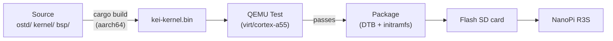
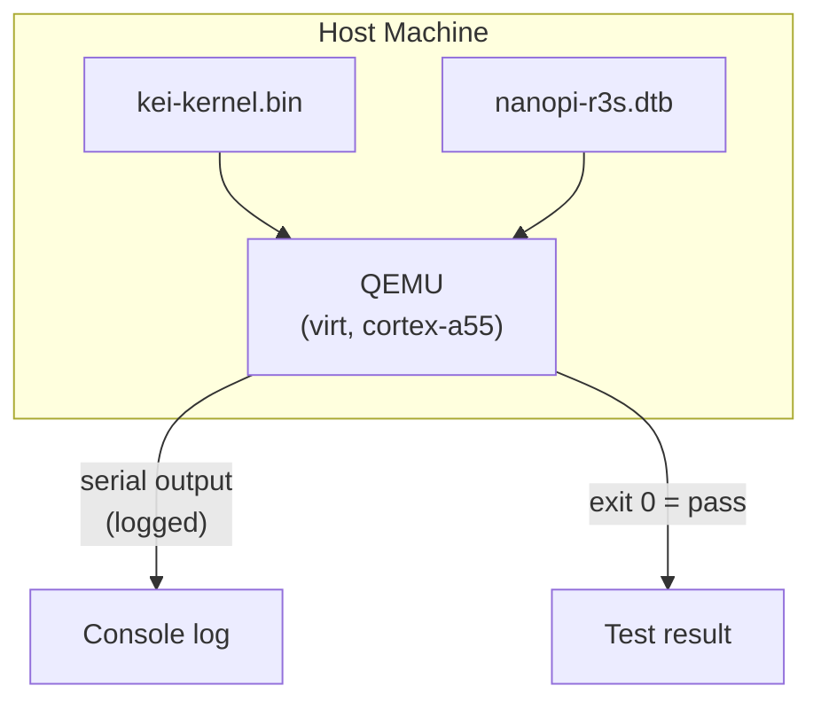
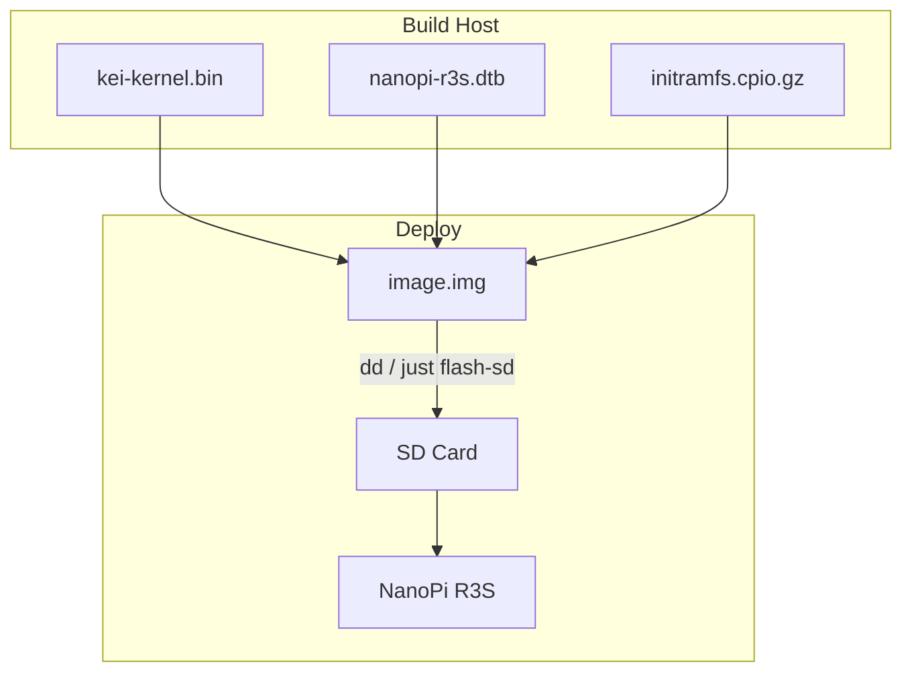
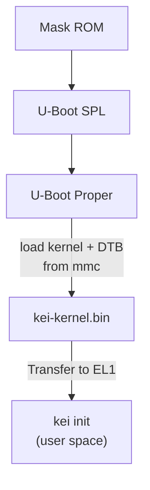

# kei Building & Deploying

## Overview

kei produces `kei-kernel.bin` — the ARM64-enabled Asterinas kernel. This guide
covers building the kernel, testing in QEMU, and deploying to physical hardware.

## Build Pipeline



## Prerequisites

- **Host**: Linux x86_64 or ARM64
- **Rust**: 1.85+ with `aarch64-unknown-none-softfloat` target
- **QEMU**: ≥ 8.0 for virt machine with cortex-a55
- **just**: `cargo install just`

## Quick Build

```bash
# One-time setup
just setup        # Configure git remotes and Rust targets

# Sync upstream sources
just vendor       # Absorb latest upstream asterinas
just versions     # Show upstream baseline versions

# Build for the NanoPi R3S
just build        # Builds kei-kernel.bin for aarch64/armv8

# Run QEMU boot tests
just test-all     # Boot-tests all supported architectures
```

## Cross-Compilation

For cross-compiling from x86_64 to aarch64:

```bash
# Add the ARM64 target (one-time)
rustup target add aarch64-unknown-none-softfloat

# Install GCC cross-toolchain (distribution-dependent)
# Ubuntu / Debian:
sudo apt install gcc-aarch64-linux-gnu binutils-aarch64-linux-gnu

# Build
cargo build --release --target aarch64-unknown-none-softfloat \
  -p kei-kernel
```

The kernel binary is a raw ARM64 Image (Linux boot protocol), not an ELF. It
boots directly from U-Boot via the `booti` command.

## QEMU Testing

Test the kernel in QEMU before deploying to hardware:



### Test Matrix

| QEMU Machine | CPU | RAM | Status | Command |
|-------------|-----|-----|--------|---------|
| virt | cortex-a55 | 2GB | ✅ Primary | `just test` |
| virt | cortex-a72 | 2GB | 🔲 Planned | — |
| virt | max | 4GB | 🔲 Planned | — |
| sbsa-ref | max | 4GB | 🔲 Planned | — |

```bash
# Run the primary test target
just test

# Manual QEMU invocation
qemu-system-aarch64 \
  -machine virt,gic-version=3 \
  -cpu cortex-a55 \
  -m 2G \
  -kernel output/kei-kernel.bin \
  -nographic
```

## Physical Deployment

### NanoPi R3S

Deploying kei to a physical NanoPi R3S:



### Flash to SD Card

```bash
# Build the complete firmware image (includes kei-kernel.bin)
just build board nanopi-r3s

# Assemble the SD card image (borrows U-Boot + GPT from an Armbian reference)
just image ARMBIAN_IMG=/path/to/armbian.img

# Flash to SD card
sudo dd if=target/output/nanopi-r3s/sdcard.img of=/dev/sdX bs=4M status=progress
sync
```

### No-Reflash Iteration

The one-time flash above is the **last** full flash required. The shipped
`boot.scr` supports two iteration workflows that never touch the GPT or the
U-Boot area:

#### TFTP netboot (recommended for bench work)

With `kei_netboot=1` (default in `armbianEnv.txt`), U-Boot fetches the
kernel, DTB and initramfs over TFTP and falls back to the SD copy when the
server is unreachable.

One-time setup on the build host:

```bash
# Serve /srv/tftp, e.g. with tftpd-hpa:
sudo apt install tftpd-hpa
sudo install -d -o "$USER" /srv/tftp/kei
```

Board-side settings (shipped as defaults in
`configs/board/nanopi-r3s/armbianEnv.txt`):

```
kei_netboot=1
kei_tftp_prefix=kei
serverip=192.0.2.74   # build host running the TFTP server — adjust to your LAN
```

Iteration loop:

```bash
python3 scripts/build.py nanopi-r3s   # rebuild kernel + DTB
scripts/push_netboot.sh               # copy artifacts into the TFTP root
# reset the board — U-Boot fetches kei over TFTP
```

To push to a remote TFTP server instead of a local directory:

```bash
KEI_TFTP_DEST=user@host:/srv/tftp scripts/push_netboot.sh
```

#### In-place SD card update (offline)

When the board is not on the build LAN, refresh an existing card (or image)
in place — only files under `/boot/` are replaced:

```bash
scripts/update_sdcard_kernel.sh --image target/output/nanopi-r3s/sdcard.img
# or, with the card in a reader on this host:
sudo scripts/update_sdcard_kernel.sh --device /dev/sdX
```

### Boot Verification

After inserting the SD card and powering on, connect via USB-TTL serial
(1500000 baud, 8N1):

```
U-Boot 2024.01 (Jan 01 2024 - 00:00:00 +0000)
...
## Loading kernel from mmc 0:1
   Image Name:   kei-kernel
   Image Type:   AArch64 Linux Kernel Image
   Data Size:    4194304 Bytes = 4 MiB
   Load Address: 00000000
   Entry Point:  00000000
## Flattened Device Tree blob at 44000000
   Booting using the fdt blob at 0x44000000

kei-kernel booting...
[KEI] initialising GICv3...
[KEI] initialising ARM Generic Timer...
[KEI] starting SMP...
[KEI] 4 cores online
...
```

### Boot Order



## Troubleshooting

| Symptom | Likely Cause | Action |
|---------|-------------|--------|
| No serial output | Wrong baud rate | Use 1500000, not 115200 |
| GICv3 init failed | QEMU machine type | Use `virt,gic-version=3` |
| SMP failed | Missing PSCI in DTB | Check `/cpus` node in device tree |
| Kernel panic | Code bug in arch layer | Audit `ostd/src/arch/aarch64/` |
| U-Boot can't find kernel | Wrong partition offset | Verify offset in `boot.scr` |
| TFTP times out, SD fallback boots | `serverip` wrong or server down | Check `kei_netboot`/`serverip` in `armbianEnv.txt`; verify tftpd serves the `kei/` prefix |
| Old kernel boots despite netboot | TFTP fetch failed silently | Watch for `[kei] netboot:` lines on serial; check TFTP server logs |
| `env import` errors at boot | Corrupt `armbianEnv.txt` | Restore from `configs/board/nanopi-r3s/armbianEnv.txt` via `update_sdcard_kernel.sh` |
