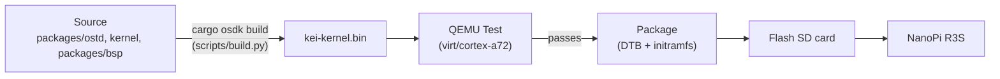
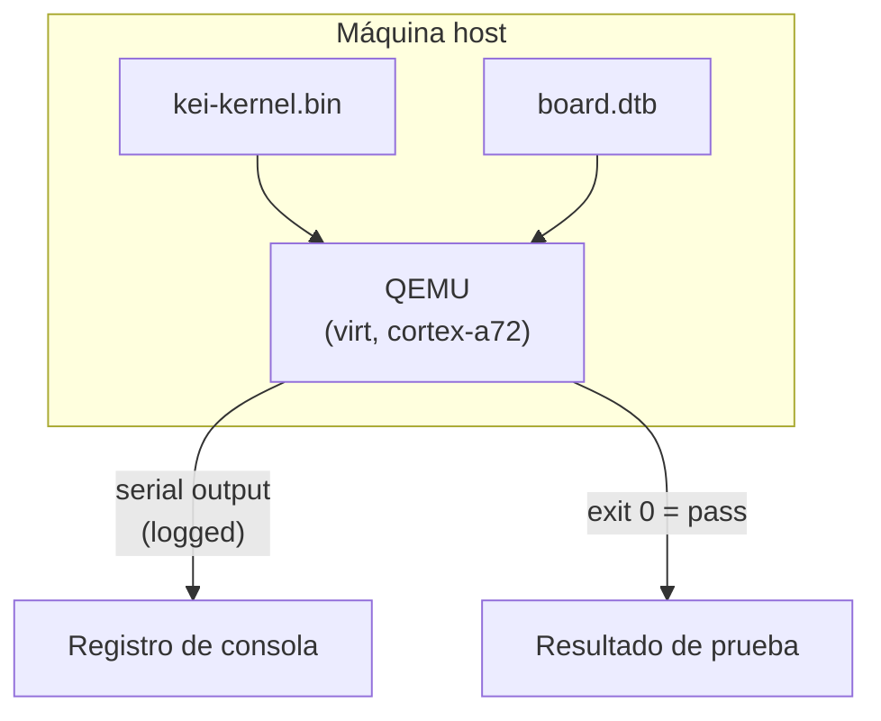
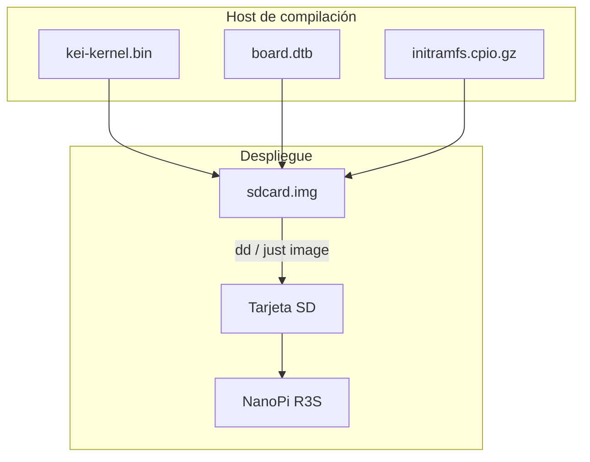
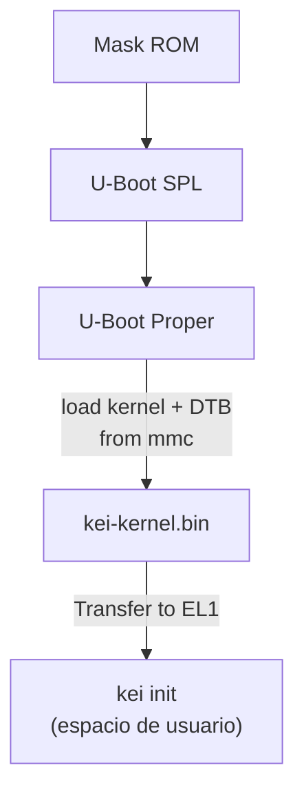

# kei Construcción y despliegue

## Visión general

kei produce `kei-kernel.bin` — el kernel Asterinas habilitado para ARM64.
Esta guía cubre la compilación del kernel, pruebas en QEMU y despliegue en
hardware físico.

## Pipeline de compilación



## Requisitos previos

- **Host**: Linux x86_64 o ARM64
- **Rust**: 1.85+ con el target `aarch64-unknown-none`
- **QEMU**: ≥ 8.0 para máquina virt con cortex-a72
- **just**: `cargo install just`

## Compilación rápida

```bash
# Stage the shared devtools recipes once (.just/ is gitignored)
just fetch

# One-time setup
just setup        # Configure git remotes

# Build for the NanoPi R3S
just build        # Builds kei-kernel.bin for aarch64/armv8

# Run QEMU boot tests
just test-all     # Boot-tests all supported architectures
```

## Compilación cruzada

Para compilar de forma cruzada de x86_64 a aarch64:

```bash
# The ARM64 target is declared in rust-toolchain.toml, so rustup installs it with
# the toolchain; adding it by hand is:
rustup target add aarch64-unknown-none

# Install GCC cross-toolchain (distribution-dependent)
# Ubuntu / Debian:
sudo apt install gcc-aarch64-linux-gnu binutils-aarch64-linux-gnu

# Build. The kernel is produced through OSDK (it needs the initramfs packed and a
# nightly cargo on PATH), so use the build script rather than a bare `cargo build`:
python3 scripts/build.py nanopi-r3s
```

El binario del kernel es una imagen ARM64 sin procesar (protocolo de arranque
Linux), no un ELF. Arranca directamente desde U-Boot mediante el comando
`booti`.

## Pruebas en QEMU

Pruebe el kernel en QEMU antes de desplegar en hardware:



### Matriz de pruebas

| Máquina QEMU | CPU | RAM | Estado | Comando |
|-------------|-----|-----|--------|---------|
| virt | cortex-a72 | 2GB | ✅ Principal | `just test` |
| virt | cortex-a72 | 2GB | 🔲 Planeado | — |
| virt | max | 4GB | 🔲 Planeado | — |
| sbsa-ref | max | 4GB | 🔲 Planeado | — |

```bash
# Run the primary test target
just test

# Manual QEMU invocation
qemu-system-aarch64 \
  -machine virt,gic-version=3 \
  -cpu cortex-a72 \
  -m 2G \
  -kernel target/output/nanopi-r3s/kei-kernel.bin \
  -nographic
```

## Despliegue físico

### NanoPi R3S

Desplegando kei en un NanoPi R3S físico:



### Grabar en tarjeta SD

```bash
# Build the complete firmware image (includes kei-kernel.bin)
just build-board nanopi-r3s

# Flash to SD card
sudo dd if=target/output/nanopi-r3s/sdcard.img of=/dev/sdX bs=4M status=progress
sync
```

### Verificación de arranque

Después de insertar la tarjeta SD y encender, conéctese mediante USB-TTL serial
(1500000 baudios, 8N1):

```
U-Boot 2024.01 (Jan 01 2024 - 00:00:00 +0000)
...
## Loading kernel from mmc 0:1
   Image Name:   kei-kernel
   Image Type:   AArch64 Linux Kernel Image
   Data Size:    4194304 Bytes = 4 MiB
   Load Address: 00000000
   Entry Point:  00000000
## Flattened Device Tree blob at 44000000
   Booting using the fdt blob at 0x44000000

kei-kernel booting...
[KEI] initialising GICv3...
[KEI] initialising ARM Generic Timer...
[KEI] starting SMP...
[KEI] 4 cores online
...
```

### Orden de arranque



## Solución de problemas

| Síntoma | Causa probable | Acción |
|---------|-------------|--------|
| Sin salida serial | Velocidad de baudios incorrecta | Use 1500000, no 115200 |
| Fallo en inicio de GICv3 | Tipo de máquina QEMU | Use `virt,gic-version=3` |
| Fallo de SMP | Falta PSCI en DTB | Verifique el nodo `/cpus` en el device tree |
| Kernel panic | Error de código en la capa de arquitectura | Audite `packages/ostd/src/arch/aarch64/` |
| U-Boot no encuentra el kernel | Offset de partición incorrecto | Verifique el offset en `boot.scr` |
