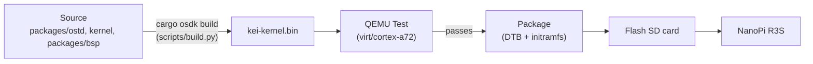
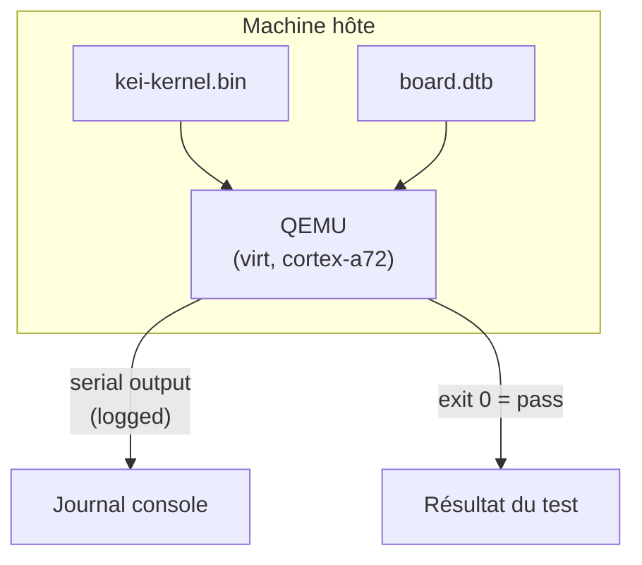
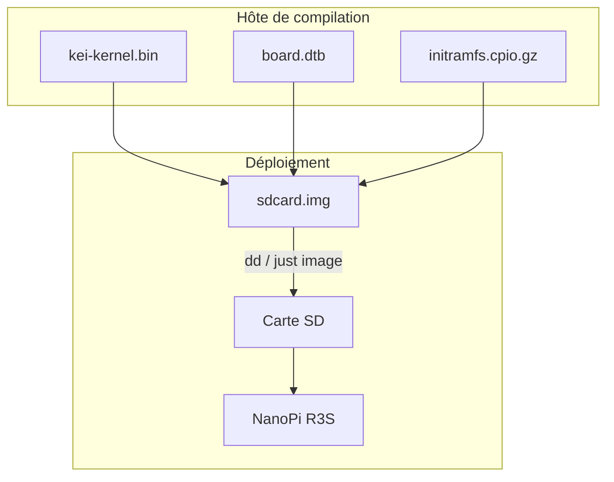
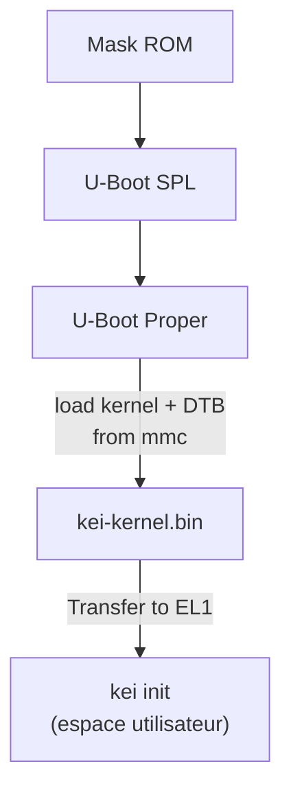

# kei Compilation et déploiement

## Aperçu

kei produit `kei-kernel.bin` — le noyau Asterinas compatible ARM64. Ce guide
couvre la compilation du noyau, les tests dans QEMU et le déploiement sur
matériel physique.

## Pipeline de compilation



## Prérequis

- **Hôte** : Linux x86_64 ou ARM64
- **Rust** : 1.85+ avec la cible `aarch64-unknown-none`
- **QEMU** : ≥ 8.0 pour la machine virt avec cortex-a72
- **just** : `cargo install just`

## Compilation rapide

```bash
# Stage the shared devtools recipes once (.just/ is gitignored)
just fetch

# One-time setup
just setup        # Configure git remotes

# Build for the NanoPi R3S
just build        # Builds kei-kernel.bin for aarch64/armv8

# Run QEMU boot tests
just test-all     # Boot-tests all supported architectures
```

## Compilation croisée

Pour la compilation croisée de x86_64 vers aarch64 :

```bash
# The ARM64 target is declared in rust-toolchain.toml, so rustup installs it with
# the toolchain; adding it by hand is:
rustup target add aarch64-unknown-none

# Install GCC cross-toolchain (distribution-dependent)
# Ubuntu / Debian:
sudo apt install gcc-aarch64-linux-gnu binutils-aarch64-linux-gnu

# Build. The kernel is produced through OSDK (it needs the initramfs packed and a
# nightly cargo on PATH), so use the build script rather than a bare `cargo build`:
python3 scripts/build.py nanopi-r3s
```

Le binaire du noyau est une image ARM64 brute (protocole de démarrage Linux),
pas un ELF. Il démarre directement depuis U-Boot via la commande `booti`.

## Tests QEMU

Testez le noyau dans QEMU avant de déployer sur le matériel :



### Matrice de test

| Machine QEMU | CPU | RAM | État | Commande |
|-------------|-----|-----|--------|---------|
| virt | cortex-a72 | 2GB | ✅ Principal | `just test` |
| virt | cortex-a72 | 2GB | 🔲 Prévu | — |
| virt | max | 4GB | 🔲 Prévu | — |
| sbsa-ref | max | 4GB | 🔲 Prévu | — |

```bash
# Run the primary test target
just test

# Manual QEMU invocation
qemu-system-aarch64 \
  -machine virt,gic-version=3 \
  -cpu cortex-a72 \
  -m 2G \
  -kernel target/output/nanopi-r3s/kei-kernel.bin \
  -nographic
```

## Déploiement physique

### NanoPi R3S

Déploiement de kei sur un NanoPi R3S physique :



### Flasher sur la carte SD

```bash
# Build the complete firmware image (includes kei-kernel.bin)
just build-board nanopi-r3s

# Flash to SD card
sudo dd if=target/output/nanopi-r3s/sdcard.img of=/dev/sdX bs=4M status=progress
sync
```

### Vérification du démarrage

Après avoir inséré la carte SD et mis sous tension, connectez-vous via USB-TTL
série (1500000 bauds, 8N1) :

```
U-Boot 2024.01 (Jan 01 2024 - 00:00:00 +0000)
...
## Loading kernel from mmc 0:1
   Image Name:   kei-kernel
   Image Type:   AArch64 Linux Kernel Image
   Data Size:    4194304 Bytes = 4 MiB
   Load Address: 00000000
   Entry Point:  00000000
## Flattened Device Tree blob at 44000000
   Booting using the fdt blob at 0x44000000

kei-kernel booting...
[KEI] initialising GICv3...
[KEI] initialising ARM Generic Timer...
[KEI] starting SMP...
[KEI] 4 cores online
...
```

### Ordre de démarrage



## Dépannage

| Symptôme | Cause probable | Action |
|---------|-------------|--------|
| Pas de sortie série | Mauvais débit en bauds | Utilisez 1500000, pas 115200 |
| Échec d'initialisation GICv3 | Type de machine QEMU | Utilisez `virt,gic-version=3` |
| Échec SMP | PSCI manquant dans le DTB | Vérifiez le nœud `/cpus` dans le device tree |
| Kernel panic | Bug de code dans la couche d'architecture | Auditez `packages/ostd/src/arch/aarch64/` |
| U-Boot ne trouve pas le noyau | Offset de partition incorrect | Vérifiez l'offset dans `boot.scr` |
