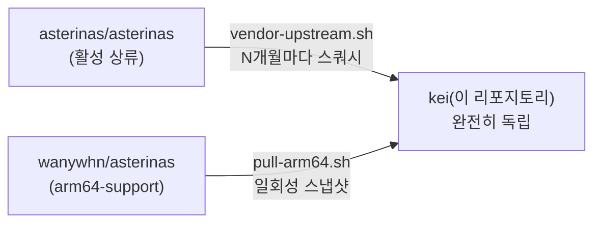
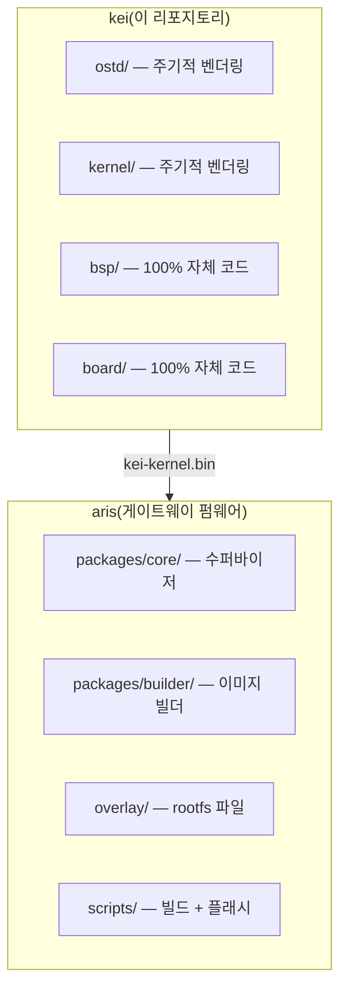

<p align="center"></p>

<h1 align="center">kei</h1>

<p align="center"><strong>Asterinas ARM64 포크 —— 산업용 IoT 게이트웨이용 독립 커널</strong></p>

<div align="center">

[](../../LICENSE)
[](../../LICENSE-MPL)
[](https://github.com/celestia-island/kei/actions/workflows/ci.yml)

</div>

<div align="center">

[English](../en/README.md) ·
[简体中文](../zhs/README.md) ·
[繁體中文](../zht/README.md) ·
[日本語](../ja/README.md) ·
**한국어** ·
[Français](../fr/README.md) ·
[Español](../es/README.md) ·
[Русский](../ru/README.md) ·
[العربية](../ar/README.md)

</div>

## 소개

kei는 [asterinas/asterinas](https://github.com/asterinas/asterinas)의 독립 포크로,
ARM64 지원과 산업용 IoT 게이트웨이용 보드 지원 패키지(BSP)를 제공합니다.
[aris](https://github.com/celestia-island/aris)가 사용하는 `kei-kernel.bin`을 생성합니다.

## 포크 모델

kei는 상류를 추적하는 브랜치가 **아닙니다**. 독립적인 포크로서 자체 일정에 따라 주기적으로
상류 변경 사항을 흡수합니다 —— Apple이 자사 LLVM 포크에 사용하는 모델과 동일합니다.



kei는 `ostd/src/arch/aarch64/`, `kernel/src/arch/aarch64/`,
`bsp/`, `board/`, `configs/`, `docs/`를 독자적으로 유지 관리합니다.

## aris와의 관계



## 빠른 시작

```bash
just setup        # Configure git remotes
just vendor       # Absorb latest upstream asterinas (squash)
just pull-arm64   # Pull ARM64 code from wanywhn fork (one-time)
just versions     # Show what upstream versions we're based on
just build        # Build kernel for nanopi-r3s (aarch64)
just test-all     # Boot-test all architectures in QEMU
```

## 디렉토리 안내

| 디렉토리 | 출처 | 유지 보수 |
|-----------|--------|-------------|
| `ostd/` | 상류 asterinas | 주기적 벤더링, 버그는 즉석 수정 |
| `ostd/src/arch/aarch64/` | wanywhn 포크(PR #3270) | **독립** —— 직접 관리 |
| `kernel/` | 상류 asterinas | 주기적 벤더링 |
| `kernel/src/arch/aarch64/` | wanywhn 포크(PR #3270) | **독립** —— 직접 관리 |
| `osdk/` | 상류 asterinas | 주기적 벤더링 |
| `bsp/` | kei | **100% 자체** —— 보드 지원 패키지 |
| `board/` `configs/` | kei | **100% 자체** —— 보드 정의 |
| `scripts/` `docs/` | kei | **100% 자체** —— 도구 및 문서 |

## 지원 아키텍처

| 아키텍처 | 상태 | QEMU 테스트 |
|------|--------|-----------|
| x86_64 | 상류 Tier 1 | ✅ q35 |
| aarch64 | kei 관리(PR #3270 기반) | ✅ virt/cortex-a55 |
| riscv64 | 상류 Tier 2 | ⚠️ virt/rv64 |
| loongarch64 | 상류 Tier 3 | ⚠️ virt/max |

## 라이선스

**SySL-1.0**(합성 소스 라이선스)은 kei 자체 코드에 적용됩니다 ——
[LICENSE](../../LICENSE) 참조.

**MPL-2.0**은 벤더링된 Asterinas 코드(`ostd/`, `kernel/`, `osdk/`)에 적용됩니다 ——
[LICENSE-MPL](../../LICENSE-MPL) 참조.
