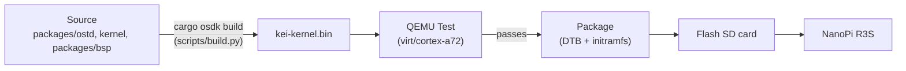
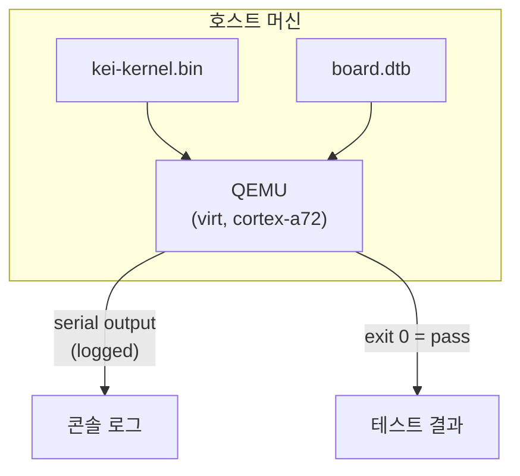
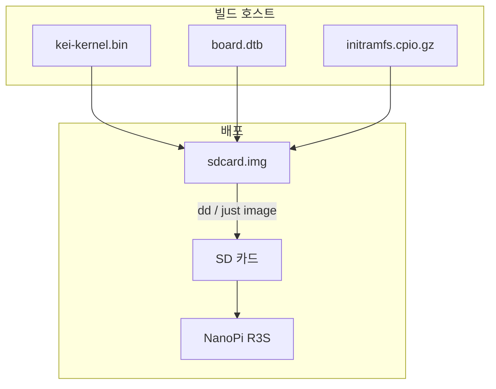
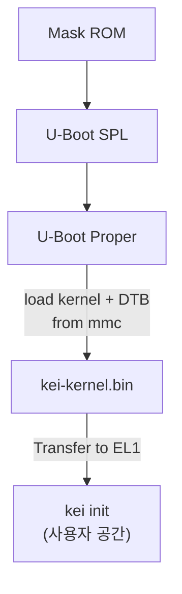

# kei 빌드 및 배포

## 개요

kei는 `kei-kernel.bin` — ARM64 지원 Asterinas 커널을 생성합니다. 이
가이드는 커널 빌드, QEMU 테스트 및 물리적 하드웨어 배포를 다룹니다.

## 빌드 파이프라인



## 사전 요구 사항

- **호스트**: Linux x86_64 또는 ARM64
- **Rust**: nightly-2026-05-01, `aarch64-unknown-none` 타겟 포함
- **QEMU**: ≥ 8.0, cortex-a72 용 virt 머신
- **just**: `cargo install just`

## 빠른 빌드

```bash
# Stage the shared devtools recipes once (.just/ is gitignored)
just fetch

# One-time setup
just setup        # Configure git remotes

# Build for the NanoPi R3S
just build        # Builds kei-kernel.bin for aarch64/armv8

# Run QEMU boot tests
just test-all     # Boot-tests all supported architectures
```

## 크로스 컴파일

x86_64에서 aarch64로 크로스 컴파일하는 경우:

```bash
# The ARM64 target is declared in rust-toolchain.toml, so rustup installs it with
# the toolchain; adding it by hand is:
rustup target add aarch64-unknown-none

# Install GCC cross-toolchain (distribution-dependent)
# Ubuntu / Debian:
sudo apt install gcc-aarch64-linux-gnu binutils-aarch64-linux-gnu

# Build. The kernel is produced through OSDK (it needs the initramfs packed and a
# nightly cargo on PATH), so use the build script rather than a bare `cargo build`:
python3 scripts/build.py nanopi-r3s
```

커널 바이너리는 ELF가 아닌 원시 ARM64 Image(Linux 부트 프로토콜)입니다.
U-Boot에서 `booti` 명령을 통해 직접 부팅합니다.

## QEMU 테스트

하드웨어에 배포하기 전에 QEMU에서 커널을 테스트합니다:



### 테스트 매트릭스

| QEMU 머신 | CPU | RAM | 상태 | 명령 |
|-------------|-----|-----|--------|---------|
| virt | cortex-a72 | 2GB | ✅ 주 | `just test` |
| virt | cortex-a72 | 2GB | 🔲 예정 | — |
| virt | max | 4GB | 🔲 예정 | — |
| sbsa-ref | max | 4GB | 🔲 예정 | — |

```bash
# Run the primary test target
just test

# Manual QEMU invocation
qemu-system-aarch64 \
  -machine virt,gic-version=3 \
  -cpu cortex-a72 \
  -m 2G \
  -kernel target/output/nanopi-r3s/kei-kernel.bin \
  -nographic
```

## 물리적 배포

### NanoPi R3S

kei를 물리적 NanoPi R3S에 배포하기:



### SD 카드에 플래시

```bash
# Build the complete firmware image (includes kei-kernel.bin)
just build board nanopi-r3s

# Assemble the SD card image (borrows U-Boot + GPT from an Armbian reference)
just image ARMBIAN_IMG=/path/to/armbian.img

# Flash to SD card
sudo dd if=target/output/nanopi-r3s/sdcard.img of=/dev/sdX bs=4M status=progress
sync
```

### 재플래시 없는 반복

위의 1회 플래시가 **마지막** 전체 플래시입니다. 함께 제공되는 `boot.scr`는 GPT나
U-Boot 영역을 건드리지 않는 두 가지 반복 워크플로를 지원합니다:

#### TFTP 넷부팅(벤치 작업 권장)

`kei_netboot=1`(`armbianEnv.txt`의 기본값)이면 U-Boot가 커널, DTB, initramfs를
TFTP로 가져오고 서버에 접근할 수 없으면 SD 카드의 사본으로 대체합니다.

빌드 호스트에서 1회 설정:

```bash
# Serve /srv/tftp, e.g. with tftpd-hpa:
sudo apt install tftpd-hpa
sudo install -d -o "$USER" /srv/tftp/kei
```

보드 측 설정(`configs/board/nanopi-r3s/armbianEnv.txt`에 기본값으로 포함):

```
kei_netboot=1
kei_tftp_prefix=kei
serverip=192.0.2.74   # build host running the TFTP server — adjust to your LAN
```

반복 루프:

```bash
python3 scripts/build.py nanopi-r3s   # rebuild kernel + DTB
scripts/push_netboot.sh               # copy artifacts into the TFTP root
# reset the board — U-Boot fetches kei over TFTP
```

로컬 디렉터리 대신 원격 TFTP 서버로 밀어넣으려면:

```bash
KEI_TFTP_DEST=user@host:/srv/tftp scripts/push_netboot.sh
```

#### SD 카드 제자리 업데이트(오프라인)

보드가 빌드 LAN에 없을 때는 기존 카드(또는 이미지)를 제자리에서 갱신합니다 —
`/boot/` 아래 파일만 교체됩니다:

```bash
scripts/update_sdcard_kernel.sh --image target/output/nanopi-r3s/sdcard.img
# or, with the card in a reader on this host:
sudo scripts/update_sdcard_kernel.sh --device /dev/sdX
```

### 부트 검증

SD 카드를 삽입하고 전원을 켠 후, USB-TTL 시리얼(1500000 보드, 8N1)로
연결합니다:

```
U-Boot 2024.01 (Jan 01 2024 - 00:00:00 +0000)
...
## Loading kernel from mmc 0:1
   Image Name:   kei-kernel
   Image Type:   AArch64 Linux Kernel Image
   Data Size:    4194304 Bytes = 4 MiB
   Load Address: 00000000
   Entry Point:  00000000
## Flattened Device Tree blob at 44000000
   Booting using the fdt blob at 0x44000000

kei-kernel booting...
[KEI] initialising GICv3...
[KEI] initialising ARM Generic Timer...
[KEI] starting SMP...
[KEI] 4 cores online
...
```

### 부트 순서



## 문제 해결

| 증상 | 가능한 원인 | 조치 |
|---------|-------------|--------|
| 시리얼 출력 없음 | 잘못된 보레이트 | 115200 대신 1500000 사용 |
| GICv3 초기화 실패 | QEMU 머신 유형 | `virt,gic-version=3` 사용 |
| SMP 실패 | DTB에 PSCI 누락 | 디바이스 트리의 `/cpus` 노드 확인 |
| Kernel panic | 아키텍처 계층의 코드 버그 | `packages/ostd/src/arch/aarch64/` 감사 |
| U-Boot가 커널을 찾을 수 없음 | 잘못된 파티션 오프셋 | `boot.scr`의 오프셋 확인 |
