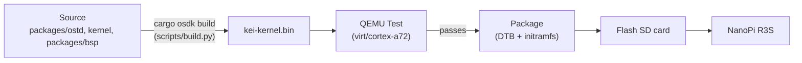
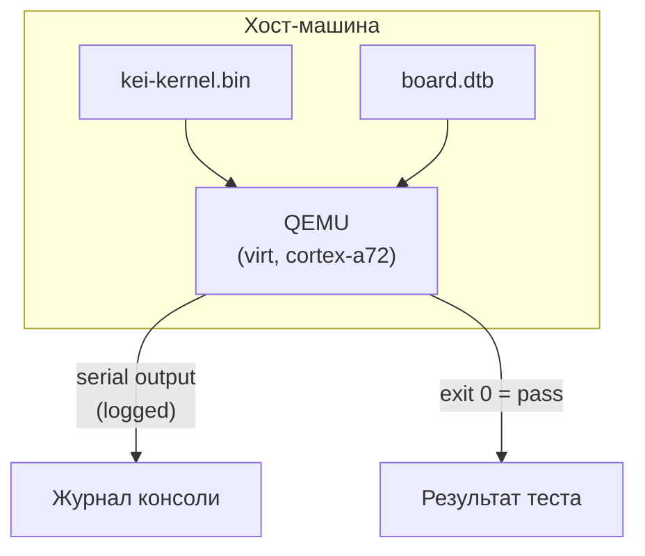
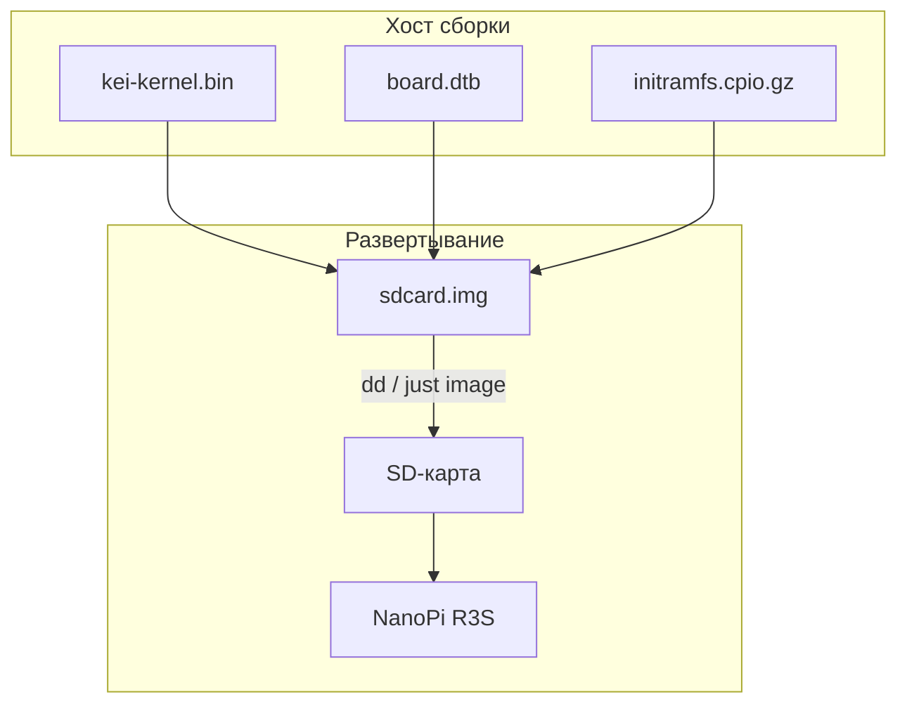
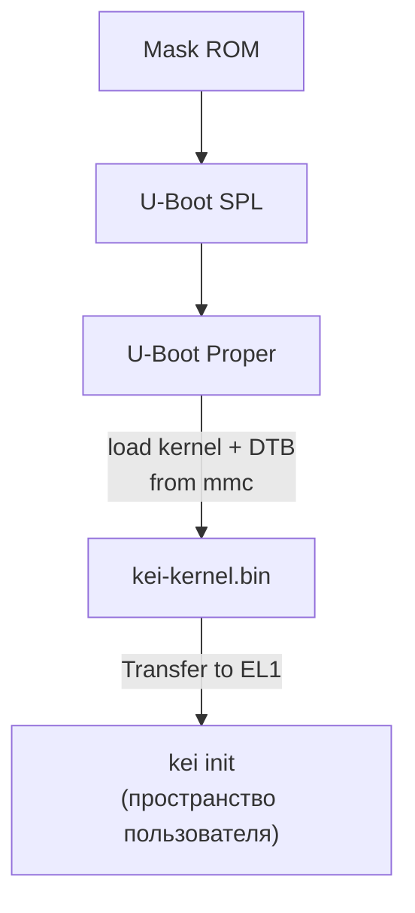

# kei Сборка и развертывание

## Обзор

kei создает `kei-kernel.bin` — ядро Asterinas с поддержкой ARM64. Это
руководство охватывает сборку ядра, тестирование в QEMU и развертывание на
физическом оборудовании.

## Конвейер сборки



## Предварительные требования

- **Хост**: Linux x86_64 или ARM64
- **Rust**: nightly-2026-05-01 с целью `aarch64-unknown-none`
- **QEMU**: ≥ 8.0 для машины virt с cortex-a72
- **just**: `cargo install just`

## Быстрая сборка

```bash
# Stage the shared devtools recipes once (.just/ is gitignored)
just fetch

# One-time setup
just setup        # Configure git remotes

# Build for the NanoPi R3S
just build        # Builds kei-kernel.bin for aarch64/armv8

# Run QEMU boot tests
just test-all     # Boot-tests all supported architectures
```

## Кросс-компиляция

Для кросс-компиляции с x86_64 на aarch64:

```bash
# The ARM64 target is declared in rust-toolchain.toml, so rustup installs it with
# the toolchain; adding it by hand is:
rustup target add aarch64-unknown-none

# Install GCC cross-toolchain (distribution-dependent)
# Ubuntu / Debian:
sudo apt install gcc-aarch64-linux-gnu binutils-aarch64-linux-gnu

# Build. The kernel is produced through OSDK (it needs the initramfs packed and a
# nightly cargo on PATH), so use the build script rather than a bare `cargo build`:
python3 scripts/build.py nanopi-r3s
```

Бинарный файл ядра — это сырой образ ARM64 Image (протокол загрузки Linux),
а не ELF. Он загружается непосредственно из U-Boot через команду `booti`.

## Тестирование в QEMU

Протестируйте ядро в QEMU перед развертыванием на оборудовании:



### Матрица тестирования

| Машина QEMU | CPU | RAM | Статус | Команда |
|-------------|-----|-----|--------|---------|
| virt | cortex-a72 | 2GB | ✅ Основной | `just test` |
| virt | cortex-a72 | 2GB | 🔲 Запланирован | — |
| virt | max | 4GB | 🔲 Запланирован | — |
| sbsa-ref | max | 4GB | 🔲 Запланирован | — |

```bash
# Run the primary test target
just test

# Manual QEMU invocation
qemu-system-aarch64 \
  -machine virt,gic-version=3 \
  -cpu cortex-a72 \
  -m 2G \
  -kernel target/output/nanopi-r3s/kei-kernel.bin \
  -nographic
```

## Физическое развертывание

### NanoPi R3S

Развертывание kei на физическом NanoPi R3S:



### Запись на SD-карту

```bash
# Build the complete firmware image (includes kei-kernel.bin)
just build board nanopi-r3s

# Assemble the SD card image (borrows U-Boot + GPT from an Armbian reference)
just image ARMBIAN_IMG=/path/to/armbian.img

# Flash to SD card
sudo dd if=target/output/nanopi-r3s/sdcard.img of=/dev/sdX bs=4M status=progress
sync
```

### Итерация без перезаписи

Единоразовая запись выше — **последняя** полная запись. Поставляемый `boot.scr`
поддерживает два цикла итерации, которые не затрагивают GPT и область U-Boot:

#### Загрузка по TFTP (рекомендуется для стендовой работы)

С `kei_netboot=1` (по умолчанию в `armbianEnv.txt`) U-Boot получает ядро, DTB и
initramfs по TFTP и при недоступности сервера возвращается к копии на SD-карте.

Разовая настройка на сборочном хосте:

```bash
# Serve /srv/tftp, e.g. with tftpd-hpa:
sudo apt install tftpd-hpa
sudo install -d -o "$USER" /srv/tftp/kei
```

Настройки на стороне платы (поставляются по умолчанию в
`configs/board/nanopi-r3s/armbianEnv.txt`):

```
kei_netboot=1
kei_tftp_prefix=kei
serverip=192.0.2.74   # build host running the TFTP server — adjust to your LAN
```

Цикл итерации:

```bash
python3 scripts/build.py nanopi-r3s   # rebuild kernel + DTB
scripts/push_netboot.sh               # copy artifacts into the TFTP root
# reset the board — U-Boot fetches kei over TFTP
```

Чтобы отправлять на удалённый TFTP-сервер вместо локального каталога:

```bash
KEI_TFTP_DEST=user@host:/srv/tftp scripts/push_netboot.sh
```

#### Обновление SD-карты на месте (офлайн)

Если плата не в сборочной LAN, обновите существующую карту (или образ) на месте —
заменяются только файлы под `/boot/`:

```bash
scripts/update_sdcard_kernel.sh --image target/output/nanopi-r3s/sdcard.img
# or, with the card in a reader on this host:
sudo scripts/update_sdcard_kernel.sh --device /dev/sdX
```

### Проверка загрузки

После установки SD-карты и включения питания подключитесь через USB-TTL
последовательный порт (1500000 бод, 8N1):

```
U-Boot 2024.01 (Jan 01 2024 - 00:00:00 +0000)
...
## Loading kernel from mmc 0:1
   Image Name:   kei-kernel
   Image Type:   AArch64 Linux Kernel Image
   Data Size:    4194304 Bytes = 4 MiB
   Load Address: 00000000
   Entry Point:  00000000
## Flattened Device Tree blob at 44000000
   Booting using the fdt blob at 0x44000000

kei-kernel booting...
[KEI] initialising GICv3...
[KEI] initialising ARM Generic Timer...
[KEI] starting SMP...
[KEI] 4 cores online
...
```

### Порядок загрузки



## Устранение неполадок

| Симптом | Вероятная причина | Действие |
|---------|-------------|--------|
| Нет вывода в последовательный порт | Неверная скорость | Используйте 1500000, а не 115200 |
| Сбой инициализации GICv3 | Тип машины QEMU | Используйте `virt,gic-version=3` |
| Сбой SMP | Отсутствует PSCI в DTB | Проверьте узел `/cpus` в дереве устройств |
| Kernel panic | Ошибка в коде архитектурного слоя | Проверьте `packages/ostd/src/arch/aarch64/` |
| U-Boot не находит ядро | Неверное смещение раздела | Проверьте смещение в `boot.scr` |
