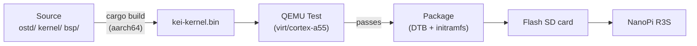
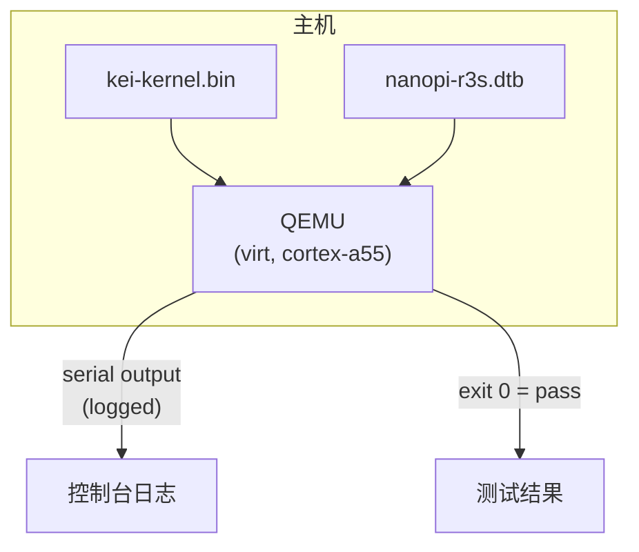
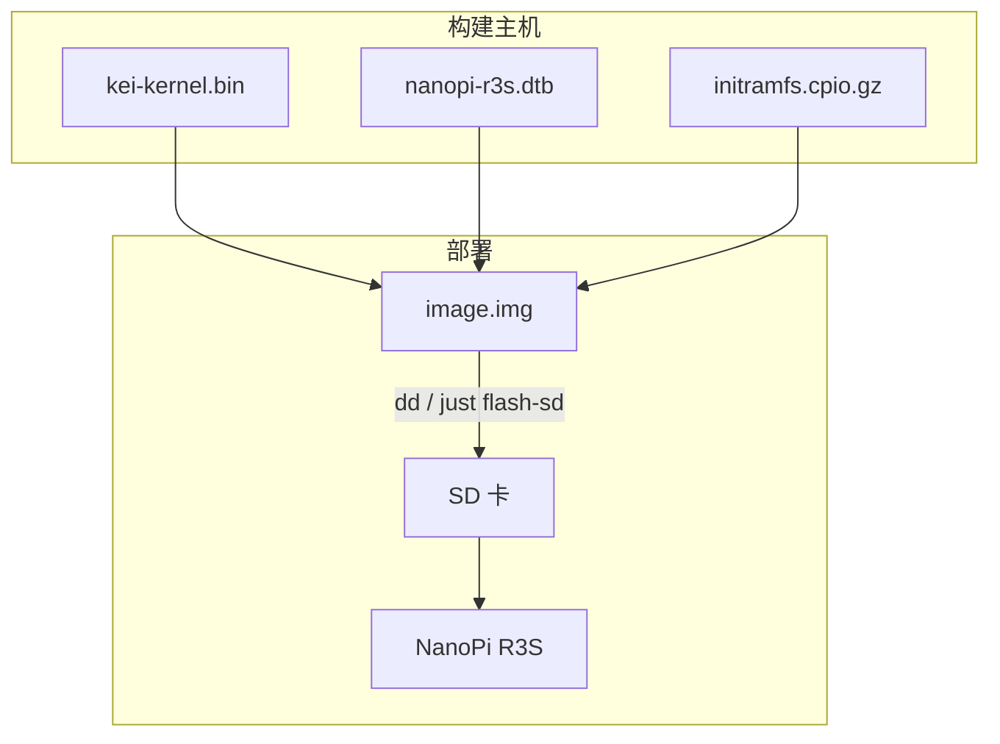
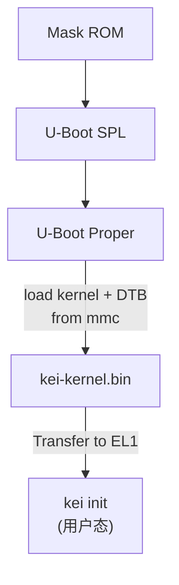

# kei 构建与部署

## 概述

kei 生成 `kei-kernel.bin` — ARM64 支持的 Asterinas 内核。本指南涵盖内核的
构建、QEMU 测试以及部署到物理硬件。

## 构建流水线



## 先决条件

- **主机**: Linux x86_64 或 ARM64
- **Rust**: 1.85+，含 `aarch64-unknown-none-softfloat` 目标
- **QEMU**: ≥ 8.0，用于 cortex-a55 的 virt 机器
- **just**: `cargo install just`

## 快速构建

```bash
# One-time setup
just setup        # Configure git remotes and Rust targets

# Sync upstream sources
just vendor       # Absorb latest upstream asterinas (squash)
just versions     # Show upstream baseline versions

# Build for the NanoPi R3S
just build        # Builds kei-kernel.bin for aarch64/armv8

# Run QEMU boot tests
just test-all     # Boot-tests all supported architectures
```

## 交叉编译

从 x86_64 交叉编译到 aarch64：

```bash
# Add the ARM64 target (one-time)
rustup target add aarch64-unknown-none-softfloat

# Install GCC cross-toolchain (distribution-dependent)
# Ubuntu / Debian:
sudo apt install gcc-aarch64-linux-gnu binutils-aarch64-linux-gnu

# Build
cargo build --release --target aarch64-unknown-none-softfloat \
  -p kei-kernel
```

内核二进制文件是原始 ARM64 Image（Linux 启动协议），而非 ELF。它通过
`booti` 命令直接从 U-Boot 启动。

## QEMU 测试

在部署到硬件之前，请在 QEMU 中测试内核：



### 测试矩阵

| QEMU 机器 | CPU | RAM | 状态 | 命令 |
|-------------|-----|-----|--------|---------|
| virt | cortex-a55 | 2GB | ✅ 主要 | `just test` |
| virt | cortex-a72 | 2GB | 🔲 计划中 | — |
| virt | max | 4GB | 🔲 计划中 | — |
| sbsa-ref | max | 4GB | 🔲 计划中 | — |

```bash
# Run the primary test target
just test

# Manual QEMU invocation
qemu-system-aarch64 \
  -machine virt,gic-version=3 \
  -cpu cortex-a55 \
  -m 2G \
  -kernel output/kei-kernel.bin \
  -nographic
```

## 物理部署

### NanoPi R3S

将 kei 部署到物理 NanoPi R3S：



### 烧录到 SD 卡

```bash
# 构建完整固件镜像（包含 kei-kernel.bin）
just build board nanopi-r3s

# 组装 SD 卡镜像（从 Armbian 参考镜像借用 U-Boot 与 GPT）
just image ARMBIAN_IMG=/path/to/armbian.img

# 烧录到 SD 卡
sudo dd if=target/output/nanopi-r3s/sdcard.img of=/dev/sdX bs=4M status=progress
sync
```

### 免烧卡迭代

上面的首次烧录是**最后一次**整卡烧录。随镜像分发的 `boot.scr` 支持两种
不再触碰 GPT 与 U-Boot 区域的迭代方式：

#### TFTP 网络启动（实验台推荐）

当 `kei_netboot=1`（`armbianEnv.txt` 默认）时，U-Boot 经 TFTP 拉取内核、
DTB 与 initramfs；服务器不可达时自动回退到 SD 卡副本。

构建机上的一次性配置：

```bash
# 以 tftpd-hpa 为例提供 /srv/tftp：
sudo apt install tftpd-hpa
sudo install -d -o "$USER" /srv/tftp/kei
```

开发板侧设置（`configs/board/nanopi-r3s/armbianEnv.txt` 已默认携带）：

```
kei_netboot=1
kei_tftp_prefix=kei
serverip=192.168.2.74   # 运行 TFTP 服务的构建机 —— 按你的局域网调整
```

迭代循环：

```bash
python3 scripts/build.py nanopi-r3s   # 重新构建内核 + DTB
scripts/push_netboot.sh               # 把产物复制进 TFTP 根目录
# 复位开发板 —— U-Boot 经 TFTP 拉取 kei
```

推送到远端 TFTP 服务器（而非本机目录）：

```bash
KEI_TFTP_DEST=user@host:/srv/tftp scripts/push_netboot.sh
```

#### 卡内原地更新（离线场景）

当开发板不在构建局域网内时，原地刷新已有 SD 卡（或镜像文件）——
只替换 `/boot/` 下的文件：

```bash
scripts/update_sdcard_kernel.sh --image target/output/nanopi-r3s/sdcard.img
# 或者 SD 卡插在本机读卡器上：
sudo scripts/update_sdcard_kernel.sh --device /dev/sdX
```

### 启动验证

插入 SD 卡并上电后，通过 USB-TTL 串口（1500000 波特，8N1）连接：

```
U-Boot 2024.01 (Jan 01 2024 - 00:00:00 +0000)
...
## Loading kernel from mmc 0:1
   Image Name:   kei-kernel
   Image Type:   AArch64 Linux Kernel Image
   Data Size:    4194304 Bytes = 4 MiB
   Load Address: 00000000
   Entry Point:  00000000
## Flattened Device Tree blob at 44000000
   Booting using the fdt blob at 0x44000000

kei-kernel booting...
[KEI] initialising GICv3...
[KEI] initialising ARM Generic Timer...
[KEI] starting SMP...
[KEI] 4 cores online
...
```

### 启动顺序



## 故障排除

| 症状 | 可能原因 | 操作 |
|---------|-------------|--------|
| 无串口输出 | 波特率错误 | 使用 1500000，而非 115200 |
| GICv3 初始化失败 | QEMU 机器类型 | 使用 `virt,gic-version=3` |
| SMP 失败 | DTB 中缺少 PSCI | 检查设备树中的 `/cpus` 节点 |
| Kernel panic | 架构层代码缺陷 | 审计 `ostd/src/arch/aarch64/` |
| U-Boot 找不到内核 | 分区偏移错误 | 检查 `boot.scr` 中的偏移量 |
| TFTP 超时、回退 SD 启动 | `serverip` 错误或服务未运行 | 检查 `armbianEnv.txt` 中 `kei_netboot`/`serverip`；确认 tftpd 服务 `kei/` 前缀 |
| netboot 已开但启动的是旧内核 | TFTP 拉取静默失败 | 观察串口是否出现 `[kei] netboot:` 行；检查 TFTP 服务日志 |
| 启动时 `env import` 报错 | `armbianEnv.txt` 损坏 | 用 `update_sdcard_kernel.sh` 从 `configs/board/nanopi-r3s/armbianEnv.txt` 恢复 |
