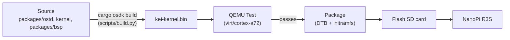
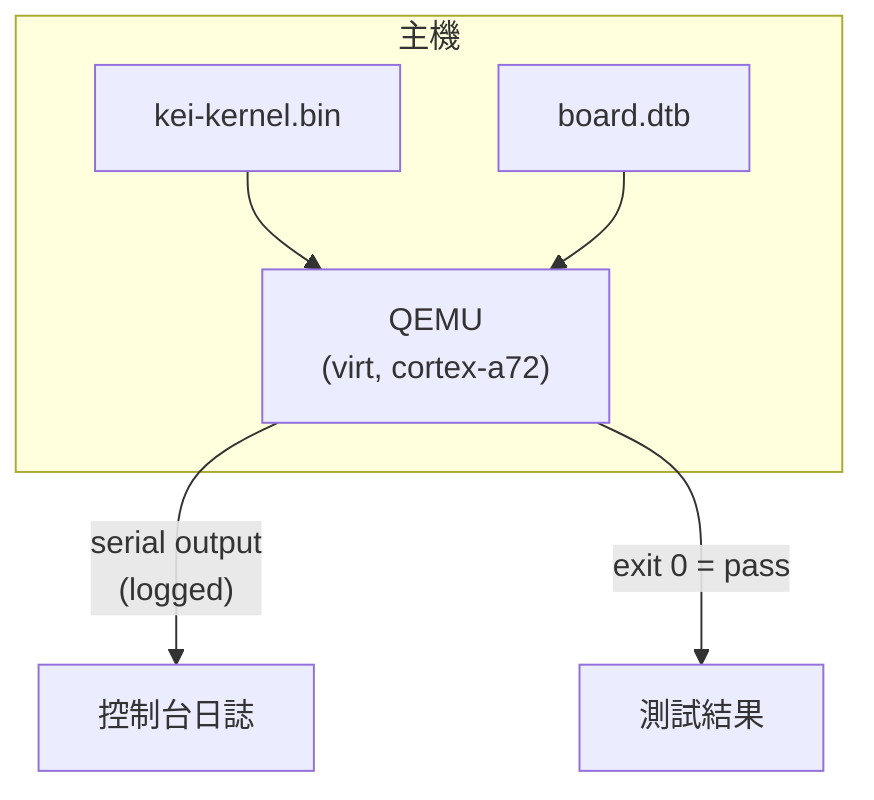
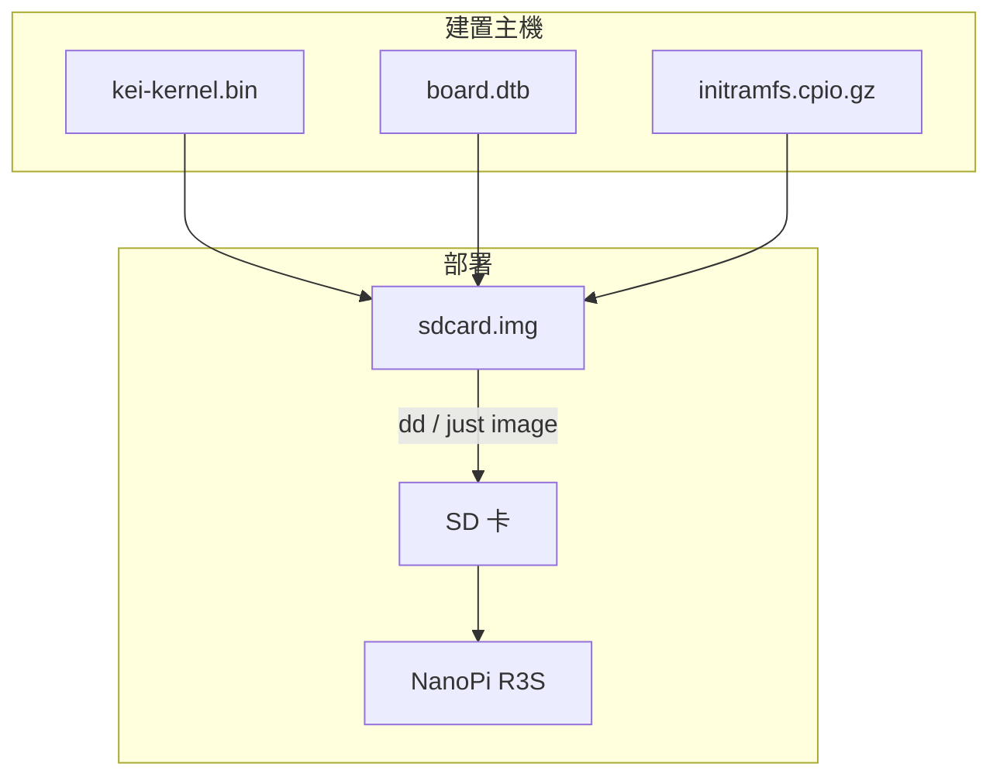
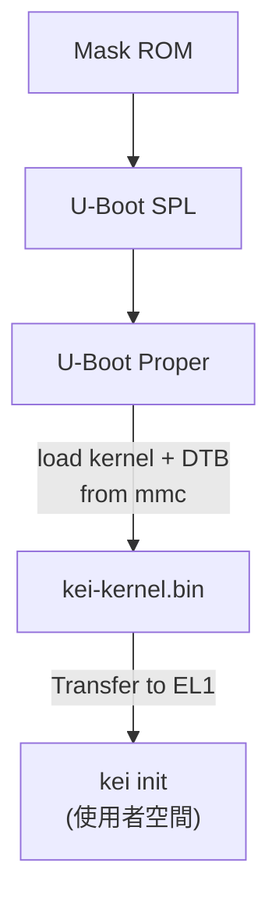

# kei 建置與部署

## 概述

kei 生成 `kei-kernel.bin` — ARM64 支援的 Asterinas 核心。本指南涵蓋核心的
建置、QEMU 測試以及部署到實體硬體。

## 建置管線



## 先決條件

- **主機**: Linux x86_64 或 ARM64
- **Rust**: nightly-2026-05-01，含 `aarch64-unknown-none` 目標
- **QEMU**: ≥ 8.0，用於 cortex-a72 的 virt 機器
- **just**: `cargo install just`

## 快速建置

```bash
# Stage the shared devtools recipes once (.just/ is gitignored)
just fetch

# One-time setup
just setup        # Configure git remotes

# Build for the NanoPi R3S
just build        # Builds kei-kernel.bin for aarch64/armv8

# Run QEMU boot tests
just test-all     # Boot-tests all supported architectures
```

## 交叉編譯

從 x86_64 交叉編譯到 aarch64：

```bash
# The ARM64 target is declared in rust-toolchain.toml, so rustup installs it with
# the toolchain; adding it by hand is:
rustup target add aarch64-unknown-none

# Install GCC cross-toolchain (distribution-dependent)
# Ubuntu / Debian:
sudo apt install gcc-aarch64-linux-gnu binutils-aarch64-linux-gnu

# Build. The kernel is produced through OSDK (it needs the initramfs packed and a
# nightly cargo on PATH), so use the build script rather than a bare `cargo build`:
python3 scripts/build.py nanopi-r3s
```

核心二進位檔案是原始 ARM64 Image（Linux 啟動協定），而非 ELF。它透過
`booti` 命令直接從 U-Boot 啟動。

## QEMU 測試

在部署到硬體之前，請在 QEMU 中測試核心：



### 測試矩陣

| QEMU 機器 | CPU | RAM | 狀態 | 命令 |
|-------------|-----|-----|--------|---------|
| virt | cortex-a72 | 2GB | ✅ 主要 | `just test` |
| virt | cortex-a72 | 2GB | 🔲 計畫中 | — |
| virt | max | 4GB | 🔲 計畫中 | — |
| sbsa-ref | max | 4GB | 🔲 計畫中 | — |

```bash
# Run the primary test target
just test

# Manual QEMU invocation
qemu-system-aarch64 \
  -machine virt,gic-version=3 \
  -cpu cortex-a72 \
  -m 2G \
  -kernel target/output/nanopi-r3s/kei-kernel.bin \
  -nographic
```

## 實體部署

### NanoPi R3S

將 kei 部署到實體 NanoPi R3S：



### 燒錄到 SD 卡

```bash
# Build the complete firmware image (includes kei-kernel.bin)
just build board nanopi-r3s

# Assemble the SD card image (borrows U-Boot + GPT from an Armbian reference)
just image ARMBIAN_IMG=/path/to/armbian.img

# Flash to SD card
sudo dd if=target/output/nanopi-r3s/sdcard.img of=/dev/sdX bs=4M status=progress
sync
```

### 免燒卡迭代

上面的單次燒錄就是**最後一次**完整燒錄。隨附的 `boot.scr` 支援兩種不會動到
GPT 與 U-Boot 區塊的迭代流程：

#### TFTP 網路開機（實驗台建議）

設定 `kei_netboot=1`（`armbianEnv.txt` 的預設值）後，U-Boot 會透過 TFTP 取得
核心、DTB 與 initramfs，伺服器不可達時退回 SD 卡上的副本。

建置主機上的單次設定：

```bash
# Serve /srv/tftp, e.g. with tftpd-hpa:
sudo apt install tftpd-hpa
sudo install -d -o "$USER" /srv/tftp/kei
```

板端設定（`configs/board/nanopi-r3s/armbianEnv.txt` 內建預設值）：

```
kei_netboot=1
kei_tftp_prefix=kei
serverip=192.0.2.74   # build host running the TFTP server — adjust to your LAN
```

迭代循環：

```bash
python3 scripts/build.py nanopi-r3s   # rebuild kernel + DTB
scripts/push_netboot.sh               # copy artifacts into the TFTP root
# reset the board — U-Boot fetches kei over TFTP
```

要推送到遠端 TFTP 伺服器而非本機目錄時：

```bash
KEI_TFTP_DEST=user@host:/srv/tftp scripts/push_netboot.sh
```

#### SD 卡就地更新（離線）

當板子不在建置 LAN 上時，可就地更新現有卡片（或映像）— 只會替換 `/boot/`
下的檔案：

```bash
scripts/update_sdcard_kernel.sh --image target/output/nanopi-r3s/sdcard.img
# or, with the card in a reader on this host:
sudo scripts/update_sdcard_kernel.sh --device /dev/sdX
```

### 啟動驗證

插入 SD 卡並上電後，透過 USB-TTL 序列埠（1500000 鮑率，8N1）連接：

```
U-Boot 2024.01 (Jan 01 2024 - 00:00:00 +0000)
...
## Loading kernel from mmc 0:1
   Image Name:   kei-kernel
   Image Type:   AArch64 Linux Kernel Image
   Data Size:    4194304 Bytes = 4 MiB
   Load Address: 00000000
   Entry Point:  00000000
## Flattened Device Tree blob at 44000000
   Booting using the fdt blob at 0x44000000

kei-kernel booting...
[KEI] initialising GICv3...
[KEI] initialising ARM Generic Timer...
[KEI] starting SMP...
[KEI] 4 cores online
...
```

### 啟動順序



## 故障排除

| 症狀 | 可能原因 | 操作 |
|---------|-------------|--------|
| 無序列埠輸出 | 鮑率錯誤 | 使用 1500000，而非 115200 |
| GICv3 初始化失敗 | QEMU 機器類型 | 使用 `virt,gic-version=3` |
| SMP 失敗 | DTB 中缺少 PSCI | 檢查裝置樹中的 `/cpus` 節點 |
| Kernel panic | 架構層程式碼缺陷 | 審計 `packages/ostd/src/arch/aarch64/` |
| U-Boot 找不到核心 | 分割區偏移錯誤 | 檢查 `boot.scr` 中的偏移量 |
