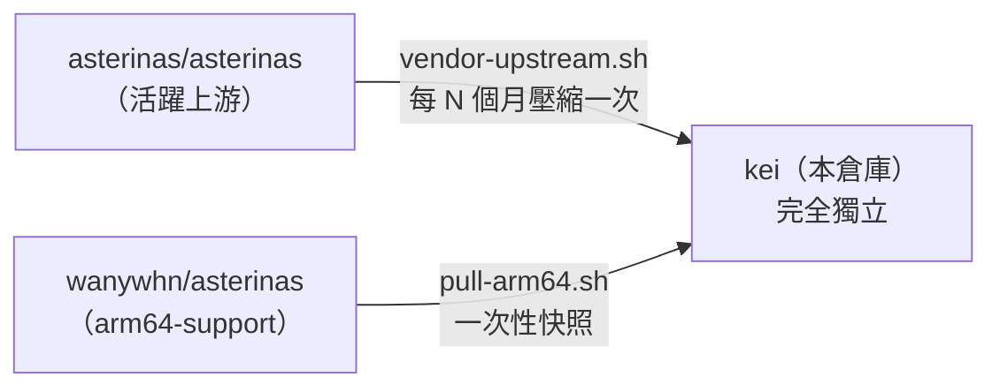
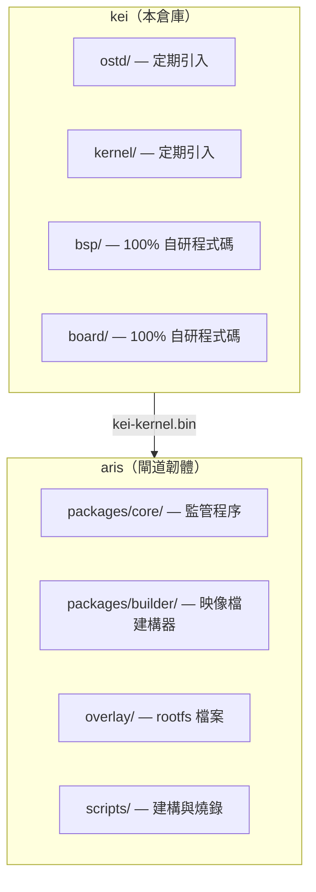

<p align="center"></p>

<h1 align="center">KEI</h1>

<p align="center"><strong>Asterinas ARM64 分支 —— 面向工業物聯網閘道的獨立核心</strong></p>

<div align="center">

[](../../LICENSE)
[](../../LICENSE-MPL)
[](https://github.com/celestia-island/kei/actions/workflows/ci.yml)

</div>

<div align="center">

[English](../en/README.md) ·
[简体中文](../zhs/README.md) ·
**繁體中文** ·
[日本語](../ja/README.md) ·
[한국어](../ko/README.md) ·
[Français](../fr/README.md) ·
[Español](../es/README.md) ·
[Русский](../ru/README.md) ·
[العربية](../ar/README.md)

</div>

## 簡介

KEI 是 [asterinas/asterinas](https://github.com/asterinas/asterinas) 的獨立分支，
提供 ARM64 支援以及面向工業物聯網閘道的板級支援包（BSP）。它產生被
[aris](https://github.com/celestia-island/aris) 使用的 `kei-kernel.bin`。

## 分支模式

KEI **不是**追蹤上游的分支。它是一個獨立分支，按自己的節奏定期吸收上游變更 ——
與 Apple 維護其 LLVM 分支採用相同的模式。



KEI 獨立維護 `ostd/src/arch/aarch64/`、`kernel/src/arch/aarch64/`、
`bsp/`、`board/`、`configs/` 以及 `docs/`。

## 與 aris 的關係



## 快速開始

```bash
just setup        # Configure git remotes
just vendor       # Absorb latest upstream asterinas (squash)
just pull-arm64   # Pull ARM64 code from wanywhn fork (one-time)
just versions     # Show what upstream versions we're based on
just build        # Build kernel for nanopi-r3s (aarch64)
just test-all     # Boot-test all architectures in QEMU
```

## 各目錄職責

| 目錄 | 來源 | 維護方式 |
|-----------|--------|-------------|
| `ostd/` | 上游 asterinas | 定期引入，缺陷就地修復 |
| `ostd/src/arch/aarch64/` | wanywhn 分支（PR #3270） | **獨立** —— 由我們維護 |
| `kernel/` | 上游 asterinas | 定期引入 |
| `kernel/src/arch/aarch64/` | wanywhn 分支（PR #3270） | **獨立** —— 由我們維護 |
| `osdk/` | 上游 asterinas | 定期引入 |
| `bsp/` | kei | **100% 自研** —— 板級支援包 |
| `board/` `configs/` | kei | **100% 自研** —— 板級定義 |
| `scripts/` `docs/` | kei | **100% 自研** —— 工具與文件 |

## 支援的架構

| 架構 | 狀態 | QEMU 測試 |
|------|--------|-----------|
| x86_64 | 上游 Tier 1 | ✅ q35 |
| aarch64 | kei 維護（源自 PR #3270） | ✅ virt/cortex-a55 |
| riscv64 | 上游 Tier 2 | ⚠️ virt/rv64 |
| loongarch64 | 上游 Tier 3 | ⚠️ virt/max |

## 授權條款

**SySL-1.0**（合成原始碼授權條款）適用於 kei 自身程式碼 —— 見
[LICENSE](../../LICENSE)。

**MPL-2.0** 適用於引入的 Asterinas 程式碼（`ostd/`、`kernel/`、`osdk/`） —— 見
[LICENSE-MPL](../../LICENSE-MPL)。
